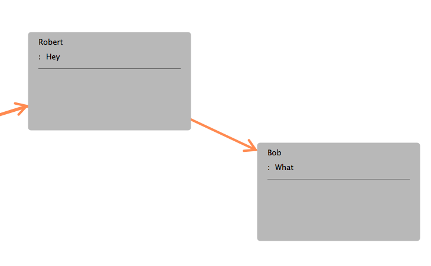

DDRectangleHelpers
==================

Category on NSView (though could be readily converted to CGPoint/CGRect for iOS use)

Some trivial helpers for rects & points but most notably a couple of methods to allow you to calculate the point on the edge of a rectangle that a line passing through the center of that rectangle will hit.

e.g

	CGFloat attackAngle = [NSView angleOfAttack:start.center forRect:end.frame];    
	NSPoint endpoint = [NSView edgePointForAttackAngle:attackAngle inRect:end.frame];    
	[self drawArrowFrom:start.center to:endpoint];

